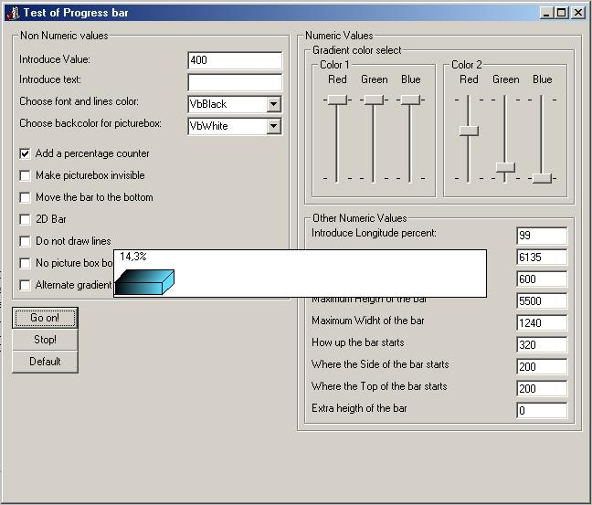



## Simulated 3D Progressbar

### Description

This code allows you to implement a 3D Progressbar in your form without the use of a OCX
 
### More Info
 
Use this code only requires 3 parameters, the name of a picturebox control in a form, the name of the form, and a numeric value at your choice. There is a whole bunch of other parameters, but all they are optional and used only for customizing the progress bar aspect.

All the code is heavily commented, parameter to parameter, so it will be easy to use.

Simulated 3D Progressbar creates a 3D progressbar in your form that show how much time a process will take. I designed it to use it within repetition structures like Next..For and Do..Loop, but may be given other uses.

The Progressbar drawing may seem imperfectly sometimes. Is required to put the picturebox in front of all other controls in the form

             |
---                |---
**Submitted On**   |2004-08-30 10:42:56
**By**             |[Marco Antonio Calvente Nieto](https://github.com/Planet-Source-Code/PSCIndex/blob/master/ByAuthor/marco-antonio-calvente-nieto.md)
**Level**          |Intermediate
**User Rating**    |4.8 (24 globes from 5 users)
**Compatibility**  |VB 6\.0
**Category**       |[Custom Controls/ Forms/  Menus](https://github.com/Planet-Source-Code/PSCIndex/blob/master/ByCategory/custom-controls-forms-menus__1-4.md)
**World**          |[Visual Basic](https://github.com/Planet-Source-Code/PSCIndex/blob/master/ByWorld/visual-basic.md)
**Archive File**   |[Simulated\_1787588302004\.zip](https://github.com/Planet-Source-Code/marco-antonio-calvente-nieto-simulated-3d-progressbar__1-55906/archive/master.zip)

